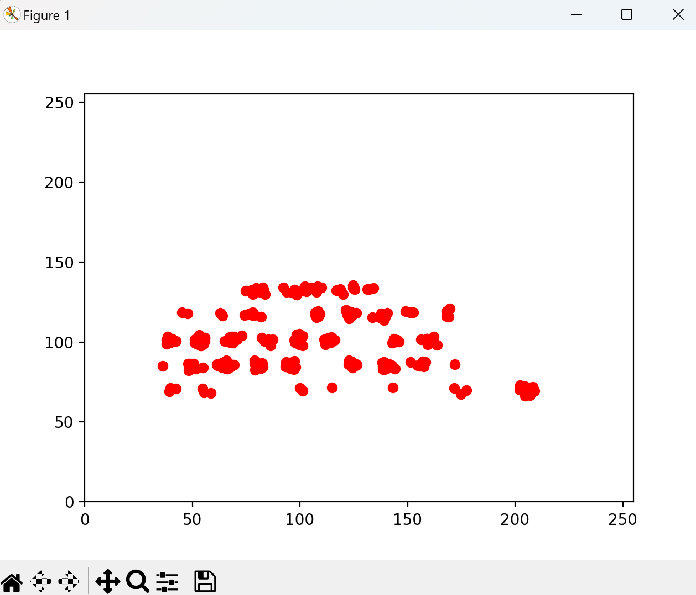

## TYPELOG
Bei dieser Challenge wurde nur eine Datei ausgeliefert. Aus dieser sollte man eine Flag extrahieren, sie muss diese also auf die eine oder andere Weise enthalten.

### Aufgabe
Wir haben hier diese Datei auf dem Gerät gefunden, tuen uns aber schwer etwas damit anzufangen. Aus zuverlässigen Quellen wissen wir, dass die Besitzerin Engländerin ist, zum Zeitpunkt als die Datei entstand jedoch mit einem Deutschen kommunizierte.

### Die Datei
Die Datei enthält viele Zeilen, die alle gleich aufgebaut sind. Nachfolgend der Aufbau beispielhaft dargestellt an einem Ausschnitt der Datei:


### Erste Gedanken zur Datei
Die Datei sieht im ersten Moment so aus, als handelte es sich dabei um Eingaben auf einem Touch-Bildschirm. Hierfür spechen unter anderem die Parameter "TABLET_TOOL_TIP" und der "pressure"-Wert, ebenso wie das abwechselnde "UP" und "DOWN". 

Nun muss aber herausgefunden werden, wie aus diesen Daten die Flag extrahiert werden kann. 

### Erster Ansatz
Ich habe nach einem online-keyboard emulator gesucht, um die Tastatur-Tastenkoordinaten einer typisch deutschen Tastatur bestimmen zu können. Da aber die Koordinaten (Der Part mit "/") aus der Datei in einem sehr engen Bereich zusammenliegen, bin ich mit keiner Website fündig geworden, d.h. es kamen keine sinnvollen Ergebnisse bei raus.

### Eigenes Programm
Aus diesem Grund habe ich mich dazu entschieden, ein eigenes Programm für die Lösung der Aufgabe zu schreiben.
Dafür habe ich die Koordinaten aufgeteilt, erster Part ist der X-Wert und zweiter der Y-Wert in einem 2-Achsigen Koordinatensystem. Dies stellt in meinem einfachen Programm praktisch den Touch-Bildschirm dar.

Das von mir programmierte Python3-Programm ist ebenfalls in diesem Ordner unter "tastaturlayout.py" zu finden.

In dem Programm versuche ich zuerst, alle Koordinaten aus der Datei "type.log" aussortieren.
Auch lese ich nur die "DOWN"-Werte ein, um Eingaben nicht doppelt im nachher erstellten Plot vorkommen zu lassen.
Dieser Prozess wird durch folgende Code-Zeilen realisiert:


Das Plotting geschieht in der Python-Datei erst gegen Ende, ich erkläre es aber als logischer erster Schritt schon hier:


### Auswertung des Plots
Mit dem Plot kann per Hovern der Maus über einer bestimmten Stelle einfach die zugehörige Koordinate erhalten werden:


Anschließend muss nur der Bereich pro Häufung an Druckpunkten analysiert werden und hier per "IF" ein Buchstabe den Koordinaten zugeordnet werden.
Dies ist nicht der schönste Weg, ging aber mit Hilfe des Copiloten sehr schnell (da nur die Integer Bereiche händisch abgeändert werden mussten).
Dies geschieht in folgenden Codezeilen:

.
.
.

Nach der Zuordnung zu einer deutschen QWERTZ Tastatur erhält man allerdings keinen sinnvollen Text.

-> Nach einigem Ausprobieren bin ich darauf gekommen, dass die Tastatur umgedreht werden muss (oben und unten gespiegelt), anschließend ergiebt sich folgender Text:

```
die flagge f=fue=er di=iese = aufgabe is=st die kombination aus db=bh in grossbuchstab=ben, e=eine o=off=fene gesc=chwei=ifte k=klammer, dem flag=ggent=te=ext = und eine geschlossene geschw=weift=te klammer.=. der flaggentext i=ist hierbei b=bil=ldschirmtast=tature=en-sind-lustig-2mdnl3=3pqx6=6w7dsnrz3h=hdn2ndsh2sk=k9, wobei alle bindestriche durch unterstr=riche er=rsetzt werde=en.=.
die flagge fuer diese aufgabe ist die kombination aus dbh in grossbuchstaben, eine offene geschweifte klammer, dem flaggentext und eine geschlossene geschweifte klammer. der flaggentext ist hierbei bildschirmtastaturen-sind-lustig-2mdnl3pqx6w7dsnrz3hdn2ndsh2sk9, wobei alle bindestriche durch unterstriche ersetzt werden.
```

Dieser ist nicht perfekt, es reicht aber, um die Flagge zu entziffern. (Das "=" ist jeweils ein Delete, feststellbar an den zwei aufeinanderfolgenden Buchstaben getrennt durch das "=")

Damit ist die Challenge gesolved!

