## Montystresor
Bei dieser Challenge konnte eine Webanwendung gestartet werden.

### Infotext
Schau dich doch mal genau um.

### Vorgehen
Da es sich um eine Webanwendung handelt ist es naheliegend, zuerst einmal die Anwendung via Browser zu erforschen. Hierbei zeigt sich folgende Seite:

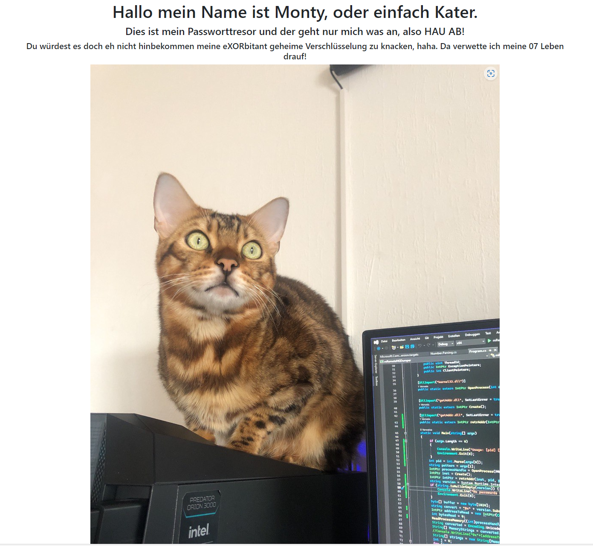

Der angezeigt Text weist auf etwas hin, mit XOR Verschlüsselt ist. Der Key ist hier wahrscheinlich "07". Nun gilt es nur zu finden, was verschlüsselt worden ist und wie einen dies weiterbringt. 
Erste Ansätze von mir waren hier, das dargestellte Bild genauer zu untersuchen und einen Directory Bruteforce zu starten.

### Directory Bruteforce
Hierfür habe ich der einfachheithalber nacheinander die Tools "dirb" und "dirbuster" gestartet:
```
dirb https://8d54cbb136.dbhchallenges.de/
```
Der erste Scan ergab leider keine Ergebnisse.
Um speziefisch mit Dateiendungen nach Dateien etc zu suchen kann das GUI-Tool "dirbuster" verwendet werden:

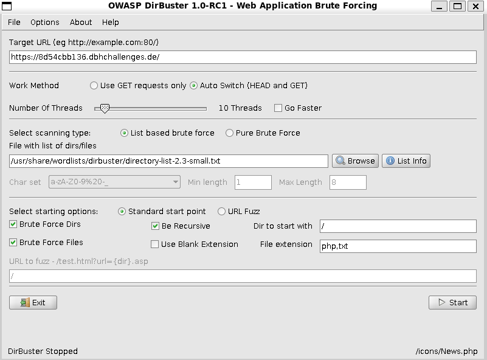

Hier habe ich ungefähr die obigen Einstellungen verwendet.

Dieser Brute Force wirft nach ein paar Sekunden bereits die folgenden Ergebnisse:

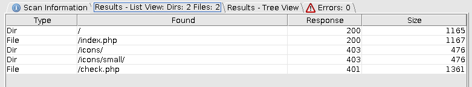

und kann damit unterbrochen werden.
-> Die Seite check.php ist auch als Hint angegeben.

### Check.php
Hier kann ein Passwort angegeben werden, um in den Tresor zu gelangen. Dieses Passwort muss allerdings ebenfalls erst herausgefunden werden.

### Weiteres Vorgehen
Nach einigem Suchen bin ich darauf gekommen, mir das Bild auf der ursprünglichen Seite genauer anzusehen.
-> Hierfür habe ich dieses heruntergeladen und mit dem Kommandozeilentool "strings" genauer untersucht:
```
strings -n 6 kleinerhelfer.jpg
```
Nach dem durchsehen der Ausgabe ist recht schnell folgender Block aufgefallen:

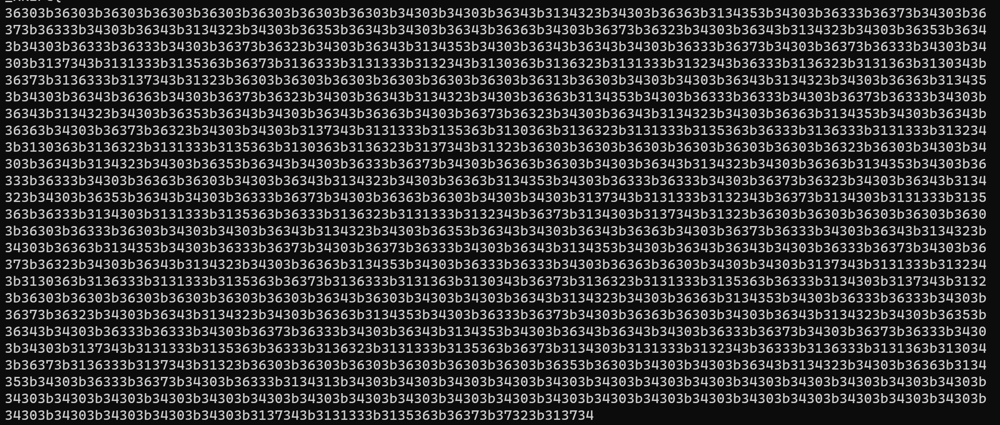

Da dies ungewöhnlich für eine Bilddatei ist, wollte ich das Gefundene weiter untersuchen.
Die Zahlenwerte liegen alle im Bereich zwischen 0-9 und a-f -> es handelt sich sehr wahrscheinlich um Hexadezimal-Code.
Dieser kann mit dem Online-Tool "Cyber-Chef" und dem Recipe "From Hex" sehr gut untersucht werden:

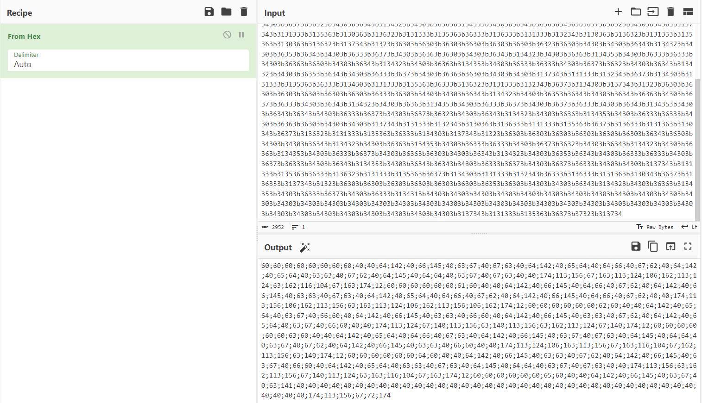

Die dabei herauskommenden Zahlenwerte sehen nach rein dezimal aus, auch sind keine Einzelwerte über 8 vorhanden und alle Zahlenblöcke mit einem Semikolon getrennt.
Als logischer nächster Schritt folgt also eine Dekodierung aus dem Oktalbereich mit Delimiter = Semikolon:

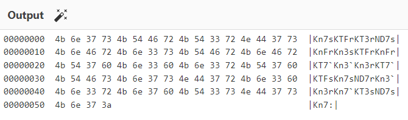

Dies liefert ein sehr viel schöneres Ergebnis.
Die erhaltene Ausgabe sieht aus wie der Ausschnitt der Ausgabe des Untersuchens einer Datei mit Hexeditor. Allerdings kann auch mit diesem Ergebnis noch nichts angefangen werden, da ich davon ausgehe, dass das Passwort ein lesbarer String ist (Eventuell auch in Leet).

Wenn man sich nur den rechten der drei Ausgabeabschnitte ansieht (getrennt jeweils an doppelten Leerzeichen), bemerkt man, dass es sich bei den Buchstaben wieder nur um Groß und Kleinbuchstaben + Zahlen handelt. Da Oktal schon verwendet wurde und ich nicht von einer zweiten Codierung mit Oktal ausgehe, habe ich überlegt was in CTFs noch typischerweise verwendet wird. Dabei bin ich auf Base, speziell Base64 gekommen. 
-> Eine dekodierung des rechten Blocks mit Base ergibt allerdings kein gescheites Ergebnis.

Nach einigem herumversuchen habe ich mich an die ursprüngliche Website erinnert - es wurde ja auf eine verXORung verwiesen mit dem Schlüssel 07.
Das Ergebnis hiervon ist in folgendem Screenshot zu sehen:
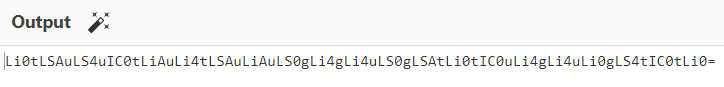

Dies sieht nun schon viel eher nach Base 64 aus! (Erkennbar an dem = als letzter Char).
Eine erneute dekodierung mit Base64 ergibt nun wieder sinnvollen Code:

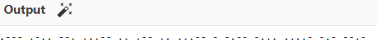

Das zu sehende ist Morsecode und kann ebenfalls wieder mit CyberChef decodiert werden. Auch zeigt es, dass man sich noch auf dem richtigen Weg befindet!
Das Ergebnis einer Decodierung ist im Folgenden zu sehen: 

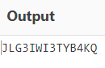

Dieser String sieht nun nicht mehr allzu sinnvoll aus, hat aber bereits die Länge, die ich als Passwort für den Tresor erwarten kann. 
Nun kommt der schwierige Part. Wie kann ich dieses Passwort noch weiter abwandeln, sodass es lesbar und sinnvoll wird?

Da sich in der Challenge ja alles eine Katze dreht, bin ich von einer weiteren Codierung ausgegangen, speziell mit der Zahl 9, da es ja im Deutschen immer wieder heißt, dass eine Katze 9 Leben besitzt. 

Dies würde auch zu der letzten, häufig verwendeten Chiffren in CTFs passen: ROT
Mit ROT9 decodiert ergibt sich das (fast) finale Passwort:
"SUP3RFR3CHK4TZ"

Eine einzige gegebenheit aus dem Seitenquelltext der "check.php" muss noch beachtet werden:

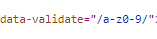

Das data-validate attribute des Input-Feldes. Hier wird ein Hinweis darauf gegeben, dass die Buchstaben in Lowercase umgewandelt werden müssen.

-- Das Finale Passwort ist also "sup3rfr3chk4tz" --

### Final
Damit ergiebt sich auch folgende Seite:

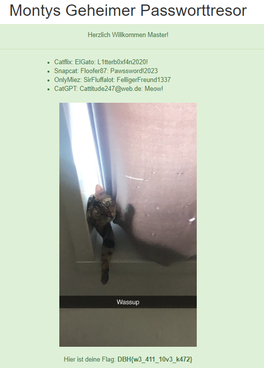

und damit die Flag:
"DBH{w3_411_10v3_k472}"

### Letzte Worte
Die Challenge an sich war spannend, ich würde sie aber nicht in die Kategorie Web einordnen!


